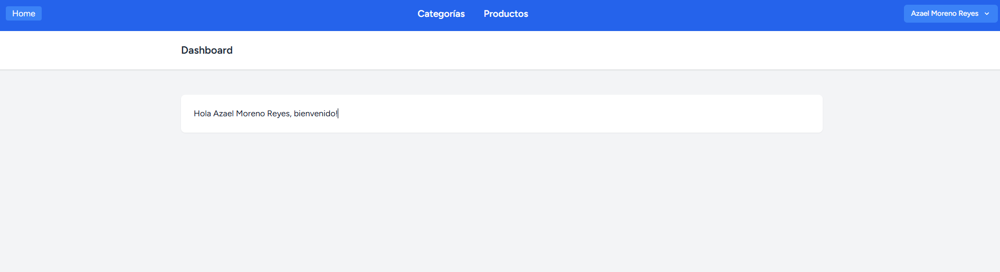
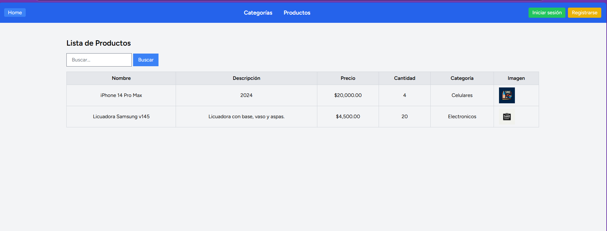
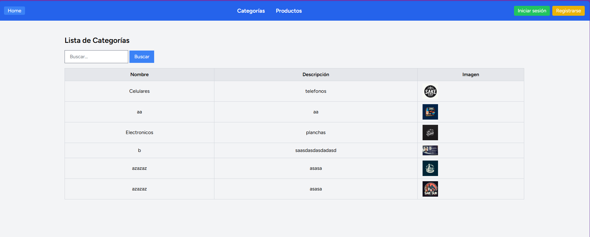
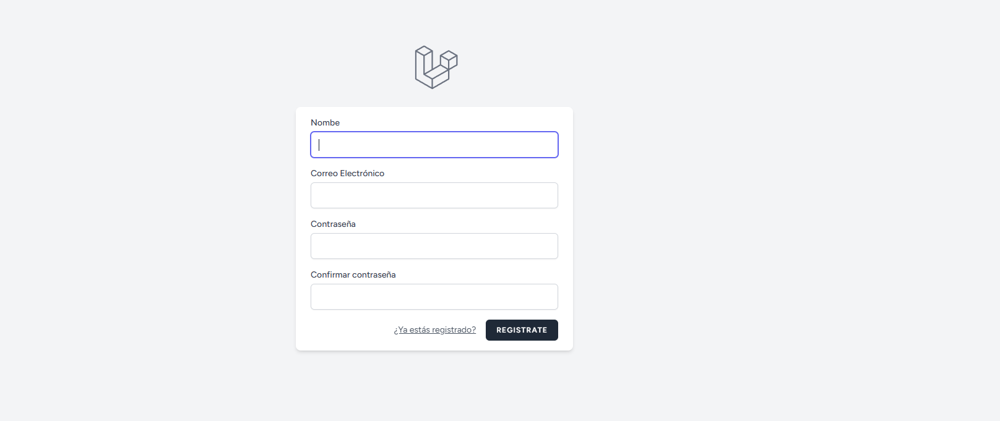
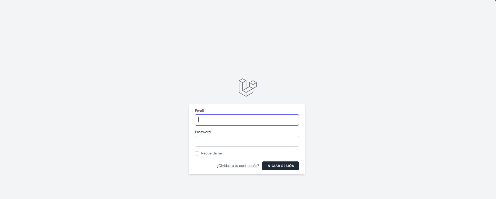
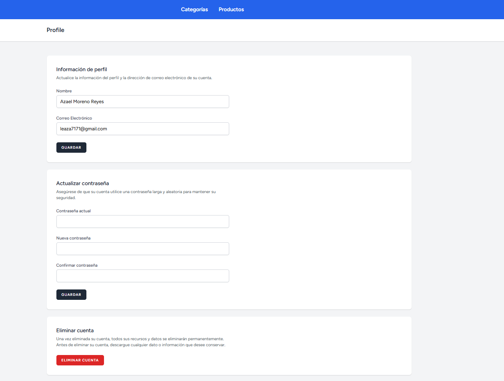

# 🛍 Prueba Técnica - Desarrollador Junior
¡Bienvenido a Prueba Técnica en Laravel! Este proyecto es un sistema de gestión de productos y categorías, desarrollado con **Laravel**, **TailwindCSS**, **Alpine.js**, y **MySQL**.

## 📌 Requisitos del sistema
Antes de instalar el proyecto, asegúrate de tener los siguientes requisitos:

- **PHP 8.1 o superior**
- **Composer** (gestor de dependencias PHP)
- **MySQL 5.7+ o MariaDB** (base de datos)
- **Node.js y NPM** (para gestionar los assets con Vite)
- **Git** (para clonar el repositorio)
- **Servidor Apache o Nginx** (para ejecutar Laravel)

## 🚀 Instrucciones de instalación
Sigue estos pasos para instalar y ejecutar el proyecto en tu entorno local:

### 1️⃣ Clonar el repositorio
```sh
git clone https://github.com/azaelomora/prueba-junior.git
cd prueba-junior
```

### 2️⃣ Configurar el entorno
```sh
cp .env.example .env
php artisan key:generate
```

### 3️⃣ Configurar la base de datos
Asegúrate de que tienes MySQL corriendo en el puerto 3307. Luego, en .env, modifica estos valores:
```ini
DB_CONNECTION=mysql
DB_HOST=127.0.0.1
DB_PORT=3307
DB_DATABASE=tienda
DB_USERNAME=root
DB_PASSWORD=
```


### 4️⃣ Instalar dependencias
Instala las dependencias de Laravel y los paquetes de frontend:

```sh
composer install
npm install
```


### 5️⃣ Ejecutar las migraciones
Crea las tablas en la base de datos con:
```sh
php artisan migrate
```

6️⃣ Ejecutar el servidor
```sh
php artisan serve
```
Accede a http://http://127.0.0.1:8000/ y disfruta tu aplicación.

## 💡 Decisiones técnicas relevantes
Este proyecto utiliza las siguientes tecnologías:

- **Laravel Breeze** para autenticación de usuarios.
- **TailwindCSS y Alpine.js** para una interfaz ágil y responsive.
- **Base de datos MySQL**, optimizada con SESSION_DRIVER=database.
- **Paginación en tablas** para optimizar la carga de productos y categorías.
- **SweetAlert2** para notificaciones interactivas.


## 📸 Capturas de pantalla

### ✅ Pantalla principal


### ✅ Lista de productos y categorías




### ✅ Registro e iniciar sesión





### ✅ Edición de perfil



## 🤝 Contribuciones
Si deseas contribuir, envía un Pull Request o abre una Issue.

